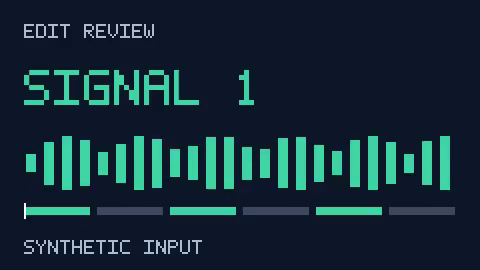
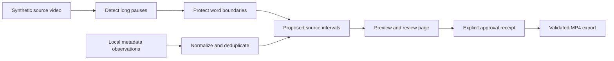

# AI-Assisted Video Editing

Long pauses make rough footage tedious to review. This project turns a bounded pause-removal task into an inspectable proposal: normalize source metadata, detect silence, protect annotated word boundaries, preview the edit, and require a reviewer before final export.

**Working output:** the offline example turns a **12-second synthetic video into a 6-second preview**, preserving **99.9979% of the annotated tone duration** in the recorded run. It also merges five metadata observations into one traceable asset. These are synthetic integration results, not measurements of speech editing or model quality.

[Watch the generated preview](examples/preview.mp4) · [Inspect the report](examples/report.json) · [Read the data contracts](docs/contracts.md)



## What I built

I implemented the editing interval logic, the review and export boundary, source normalization with field-level lineage, and the runnable evaluation pipeline. The release demonstrates how to make assisted editing decisions inspectable and reversible: media stays unchanged, proposed intervals remain visible, and approval is tied to the exact proposal and source hashes.

The default proposer is a **deterministic silence-based baseline**. A local JSON proposal interface can accept suggestions produced by a model or a person, but no model service, trained checkpoint, or learned editor is included. Model selection remains experimental; **no learned model is selected for this release**. There are no engagement or virality claims.

## Run the example

Requirements: Python **3.11–3.13**, a supported 64-bit Windows, Linux, or macOS environment, and about **200 MB of free disk/RAM headroom**. No GPU, account, credentials, or paid service is required. The pinned dependency downloads FFmpeg during installation; subsequent runs are offline. The recorded Windows run uses Python 3.13.12 and the wheel's FFmpeg 7.1 build.

```bash
git clone https://github.com/Shaboxx/ai-assisted-video-editing.git
cd ai-assisted-video-editing
python -m venv .venv
```

Activate the environment:

```powershell
# Windows PowerShell
.\.venv\Scripts\Activate.ps1
```

```bash
# macOS / Linux
source .venv/bin/activate
```

Install the single pinned dependency, run checks, then generate the review:

```bash
python -m pip install -r requirements.txt
python -m unittest discover -s tests -v
python -m video_edit demo
```

Expected console output includes:

```text
Ran 20 tests
OK
PROPOSED: 12.00s -> 6.00s; 3 kept intervals
```

Open `output/review.html` in a browser. It shows the source and preview videos, retained intervals, data lineage, and a review checklist. The fixture contains low-volume test tones and silence, **not speech**. The proposed preview is an actual H.264/AAC MP4; generating it does not approve the final edit.

After watching the preview and checking the timing, record your review and export:

```bash
python -m video_edit approve --reviewer "Your name" --note "Reviewed timing and retained content"
python -m video_edit export
```

The final output is `output/edited.mp4`, accompanied by `approval.json` and `export.json`. It contains the exact approved preview bytes. Export fails before approval, after a proposal changes, or after the original source or preview bytes change. The CLI records the operator's attestation; it cannot verify that someone actually watched the video.

`--workdir another-output` selects a separate run folder for every command. The demo regenerates its synthetic source; use a new folder to retain a previous review session.

## How it works



- **Editing:** qualify pauses at −35 dB for at least 0.6 seconds, move cut edges out of annotated words, union overlapping removals, and discard kept slivers shorter than 0.25 seconds. FFmpeg renders the surviving intervals in source order.
- **Ingestion:** normalize Unicode and whitespace; deduplicate by namespace and immutable native ID; retain observation hashes and field providers. The first nonempty value wins. Later conflicts remain visible; invalid rows receive rejection receipts.
- **Review:** an approval binds to the canonical proposal SHA-256. The proposal binds to source and preview bytes. These are rechecked before copying the reviewed preview to final output. A replacement proposal is rendered and decoded in a temporary workspace before its complete review bundle is published. Failed preparation preserves the previous review; failed publication rolls back under an exclusive CLI lock.
- **Execution:** one subprocess boundary uses argument arrays, fixed codecs, and a timeout. No shell interpolation, external API calls, or remote fetching occurs in the demo.

Implementation: [`editing.py`](video_edit/editing.py), [`ingest.py`](video_edit/ingest.py), [`contracts.py`](video_edit/contracts.py), and [`media.py`](video_edit/media.py).

## Evaluation and limitations

The committed [report](examples/report.json) was generated by this public version on **September 20, 2026**. The dataset is **one original 12-second, 480×270, 12 fps clip**: three 2-second sine-tone intervals alternating with three 2-second silent intervals. Word timestamps are synthetic guard-test annotations; no transcription was performed. There is no train/test split because this example does not train a model.

| Metric | No-cut baseline | Pause-tightening proposal |
|---|---:|---:|
| Planned duration | 12.000000 s | 5.999874 s |
| Annotated signal duration retained | 100% | 99.9979% |
| Annotated silence remaining | 6.000000 s | 0.000000 s |
| Decoded output | — | 72 video frames / 6.000 s |

These metrics use the known source-coordinate annotations. The preview is also fully decoded to confirm readable video and audio. The small signal loss comes from thresholding near sine-wave zero crossings. AAC padding adds decoded audio samples; exact byte hashes and small boundary differences can vary across FFmpeg platform builds. Timing tolerance is one frame (83.3 ms), not bit-identical encoded media.

The fixture proves pause detection, timing transformations, normalization, and approval enforcement. It does not establish quality on conversation, noisy recordings, music, multilingual speech, narrative coherence, or arbitrary user videos. Long pauses can be meaningful. Word-edge guards rely on valid timestamps and do not make erroneous silence detections safe. This CLI is intentionally fixture-focused; adapting it to arbitrary media requires duration probing and a timestamp source.

The [tests](tests/test_pipeline.py) cover overlapping pauses, boundary protection, tiny slivers, all-silence input, bad timestamps, duplicate replay, field lineage, actual FFmpeg rendering, unapproved export rejection, stale approvals, changed source/preview bytes, failed-proposal preservation, publication rollback, and review commands for nested or absolute output folders. [CI](.github/workflows/ci.yml) runs the example and marks its export approval as **automated fixture approval**, never human review.

## Optional external proposals

The [`propose --suggestions`](docs/contracts.md#external-proposal-input) command accepts validated source-coordinate intervals in a local JSON file. It invokes no external service and does not certify the suggestions as model-generated or high quality. Every suggestion still needs review. The default demo uses no mocked service; tests use explicitly labeled automated approval receipts only.

## Data, dependencies, and history

All example media is generated from original graphics and mathematical tones by `video_edit/media.py`. No downloaded footage, real-person records, model weights, or third-party datasets are included. The checked-in example JSON and preview come from the runnable example, not fabricated output.

The public history begins with a **current-date release snapshot on September 20, 2026**. Subsequent commits separate the runnable core, evaluation/CI, and documentation. Historical activity has not been reconstructed or backdated.

Dependency and media attribution are in [THIRD_PARTY_NOTICES.md](THIRD_PARTY_NOTICES.md). Project licensing is described in [LICENSE_STATUS.md](LICENSE_STATUS.md).

Technical references: FFmpeg's [silence detection](https://ffmpeg.org/ffmpeg-filters.html#silencedetect), [trim](https://ffmpeg.org/ffmpeg-filters.html#trim), and [concat](https://ffmpeg.org/ffmpeg-filters.html#concat) filter documentation; the [imageio-ffmpeg wrapper](https://github.com/imageio/imageio-ffmpeg).
